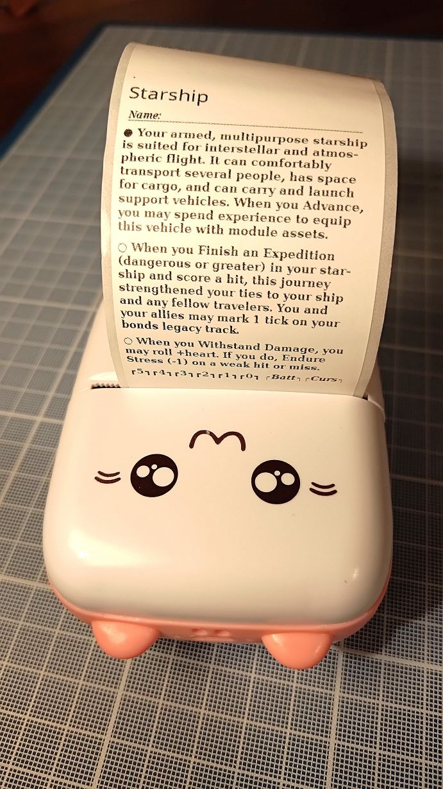

# catprintsworn

_catprintsworn_ is a
[Love2D (v11.4)](https://love2d.org)
project which generates
images of
_[Ironsworn: Starforged](https://shawn-tomkin.itch.io/ironsworn-starforged)_
solo RPG 
[Assets](https://github.com/rsek/dataforged),
for printing on
a cheap thermal "cat printer".
To avoid the risk of Chinese spyware from the printer's mobile app,
I recommend using an open-source app for printing instead,
for example the web app at:

https://print.unseen-site.fun ([source code](https://github.com/NaitLee/kitty-printer))

_catprintsworn_ is currently at early development stage,
so it's unfortunately not user-friendly at all,
and you need to be able to do some coding to use it.
To select which asset is rendered, modify `i` and `j` on the following line in `main.lua`:

https://github.com/akavel/catprintsworn/blob/f5a27525fd84e5b20ef769911d7f19189339465d/main.lua#L144

The PNG images are generated into Love2D save directory,
as documented at: https://love2d.org/wiki/love.filesystem

The generated images are exactly 384px wide,
and look more or less like below:

